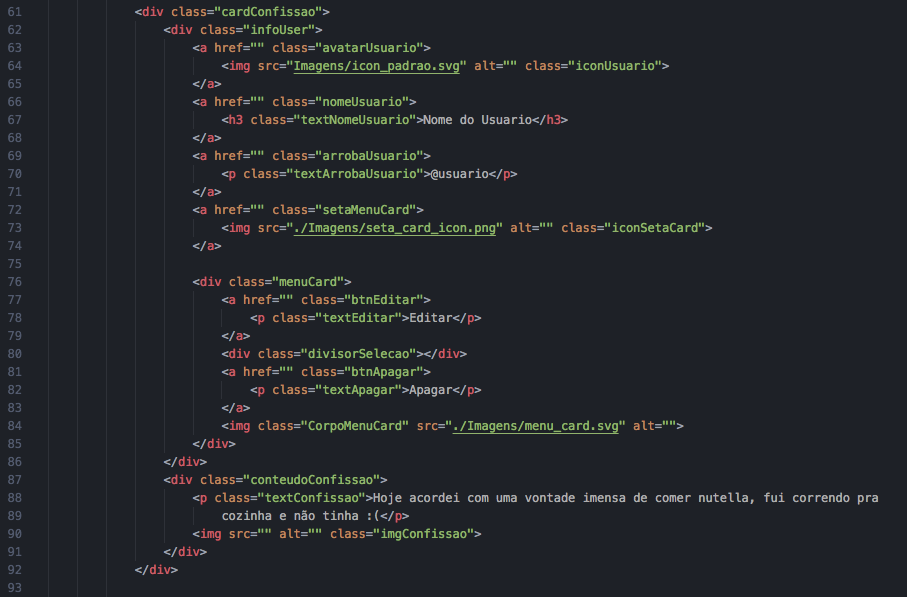

# CURSO DE PHP
**Para o Instituto Federal de Mato Grosso do Sul *campus* Dourados

Até o momento está com todas as partes de Front-end prontas, faltando apenas o php e javascript.

## Estutura Das Pastas:

  - ╔Imagens
  - ╠php
  - ╠styles
  - ║   ╠css_cadastroPage.css
  - ║   ╠css_index.css
  - ║   ╚css_loginPage.css
  - ╠cadastroPage.html
  - ╠loginPage.html
  - ╚index.html

## Partes Separadas do Codigo

Algumas partes do codigo temos que separar para serem segradas por php ou javascript.

